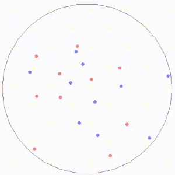
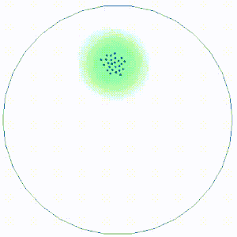

# BugBot
--------
> BugBot is a open-source 2D bug robot simulator. 

<table align="center">
  <tr>
    <td>  </td>
    <td>  </td>
  </tr>
</table>

The library is purely pythonic and easy to extend. The package can be used for researches or assignments on the subjects such as artificial intelligence, multi-agent system and robotics.The repository is designed to comfort those who had lots of pain playing with [**Stage/Player**](https://github.com/rtv/Stage) Python API. The famous 2d robot simulation package has a flawed Python API and has been out of maintenance since Ubuntu 11.04.


## Dependency
--------
- numpy
- scipy
- pyglet

## To begin with
--------
The following script is a minimal example using the package.


```python
from simulator import Simulator, Map, Agent
import numpy as np

class config:
    metadata = {
    'render.modes': ['human', 'rgb_array'],
    'video.frames_per_second': 10,
    'world_width': 300, 
    'world_height': 300,
    'screen_width': 600,
    'screen_height': 600,
    'dt': 1.0 / 10, # update interval in the system
    'eps': 1.0 # minimal distance for collision detection
    }
    rebounce = 0.5 # rebounce factor. 0 for no rebounce. 1 for rebounce with same speed at the opposite direction.

env = Simulator(config=config)
map = Map()
map.get_map_from_geom2d(env, kp=np.array([[-100,0], [100,0]]))

n_targets = 10
n_robots = 10

targets = [Agent(env, kp=np.array([[-3, 0], [3, 0]]), color=(1, 0, 0, 0.5), v_max=1.5) for i in range(n_targets)]
robots = [Agent(env,  kp=np.array([[-3, 0], [3, 0]]), color=(1, 0, 1, 0.5), v_max=2) for i in range(n_robots)]
vs = (np.random.rand(n_targets+n_robots,2) - 0.5) * 4

while True:
    env._render()
    for i in range(n_targets + n_robots):
        if np.random.rand() < 0.02:
            vs[i] = (np.random.rand(2) - 0.5) * 4
        else:
            vs[i] = vs[i]
    for i, t in enumerate(targets+robots):
        t.update(v=np.array(vs[i]))
```

In bugbot simulation, either map or agents are subclass of *Geom2d* which is a wrapper over Geom defined in [OpenAI Gym](https://github.com/openai/gym). You can define a Geom2d using *keypoints* and *geom_type*. if the length of keypoints is less than 3, geom type is automatically set to be 'circle', otherwise the default is 'polygon'. For OOP user, you will want to customize your agent as the subclass of the base class. An more compact example is also given here


```python
from simulator import Simulator, Map, Agent
from devices import Device
import numpy as np
from time import time
from utils import dist


# an example of simulator configuration
class config:
    metadata = {
    'render.modes': ['human', 'rgb_array'],
    'video.frames_per_second': 10,
    'world_width': 300,
    'world_height': 250,
    'screen_width': 600, # size of window
    'screen_height': 500, # size of window
    'dt': 1.0 / 10, # update interval in the system
    'eps': 1.0 # minimal distance for collision detection
    }
    rebounce = 0.5 # rebounce factor. 0 for no rebounce. 1 for rebounce with same speed at the opposite direction.

# example of overloading agent class
class Robot(Agent):
    def __init__(self, env):
        '''
            for each subclass of Agent you need to implement update method to update the velocity or acceleration
            to enable motion.
        '''
        Agent.__init__(self, env, 
                       kp=np.array([[-2, -2], [2, -2], [2, 2], [-2, 2]]), 
                       color=(1, 0, 0, 0.5), 
                       v_max=2.0)
        self.sensor = Sensor(env, self)
    def update(self, t):
        self.sensor.read()
        v_x = self.v_max * (np.cos(t) + np.random.rand())
        v_y = self.v_max * (np.sin(t) + np.random.rand())
        # the renderer           
        self.v = np.array([v_x, v_y])
        self.va = np.pi

# example of a range sensor that changes color when detect other agents or a obstacle.        
class Sensor(Device):
    def __init__(self, env, parent, radius=10):
        self.radius = radius
        kp=np.array([[-radius, 0], [radius, 0]])
        Device.__init__(self, env, parent, kp=kp, color=(0, 1, 0, 0.5), filled=True)
        
    def read(self):
        '''
        return true if detect something.
        '''
        for a in self.env.agents:
            if a is not self.parent and dist(self.parent, a) < self.radius:
                self.geom.set_color_rgba(np.array([1, 0, 0, 0.5]))
                print('collision with agents')
                print(dist(self.parent, a))
                return True
        print(dist(self.parent, self.env.map))
        if dist(self.parent, self.env.map) < self.radius:
            self.geom.set_color_rgba(np.array([1, 0, 0, 0.5]))
            
            return True
        
        self.geom.set_color_rgba(np.array([0, 1, 0, 0.5]))
        return False
    
    
env = Simulator(config=config)
my_map = Map()
my_map.get_map_from_geom2d(env, kp=np.array([[-100, 0], [100, 0]]))

robots = [Robot(env) for i in range(5)]

while True:
    t = time()
    [r.update(t) for r in robots]
    env._render()
```
